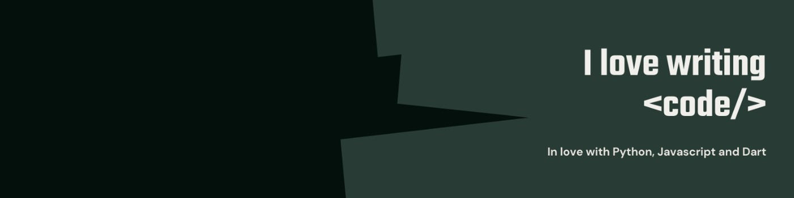

<h1 align="center">
    Greetings! Discover the digital frontier: the intersection of creative problem-solving and code, meticulousy curated by Brian Bett. 🌌🎨👋
</h1>

  I'm a passionate software engineer who loves solving complex problems and building innovative solutions. Welcome to my GitHub space!

  

  

  

---

### 🚀 About Me

- 🌱 Currently **mastering Dart & Flutter** for seamless cross-platform development.
- 💻 Passionate about **Open Source Projects**, **AI & Machine Learning**.
- 🎯 Strong advocate for **clean code, best practices, and problem-solving**.
- 🤝 Looking to collaborate on **Web, Mobile, and AI-based projects**.
- 🧠 Always learning and expanding my **Data Structures & Algorithms** knowledge.
- 🎨 UI/UX enthusiast, aiming for **engaging and accessible interfaces**.
- 📫 Reach me at **brianbett756@gmail.com**

---

### 🚀 Featured Projects
- 🔹 [SkillUp](https://github.com/BrianBett125/skillup) - A platform to help developers level up their coding skills.
- 🔹 [Nail It](https://github.com/BrianBett125/nail_it) - A productivity tool for tracking daily tasks.
- 🔹 [Python Projects](https://github.com/BrianBett125/python-projects) - A collection of Python scripts for automation.

---

### 🛠️ Languages & Tools

  
  
  
  
  
  
  
  
  
  
  
  

---

### 📫 Let's Connect!

  
  
  

---

### 🚀 Fun Facts

- 🎵 I code better when listening to **lo-fi beats or classical music**.
- ☕ I function on **coffee, curiosity, and clean code**.
- 🧩 Solving **coding puzzles** is my idea of fun.
- 🚀 My dream is to **build a startup that impacts millions**.
- 🔧 Debugging is like being a detective in a crime movie where **you're also the murderer**.
- 💡 *"Code is like humor. When you have to explain it, it’s bad."* - *Cory House*
- 🖥️ **Ada Lovelace was the first woman programmer**.
- 🔥 The first-ever computer virus was created in 1986 and was called "Brain"!
- 🚀 Did you know? The first website ever made is still online at [info.cern.ch](http://info.cern.ch/)!

...
<h1 align="center">
    Greetings! Discover the digital frontier: the intersection of creative problem-solving and code, meticulousy curated by Brian Bett. 🌌🎨👋
</h1>

  I'm a passionate software engineer who loves solving complex problems and building innovative solutions. Welcome to my GitHub space!

  

  

  

---

### 🚀 About Me

- 🌱 Currently **mastering Dart & Flutter** for seamless cross-platform development.
- 💻 Passionate about **Open Source Projects**, **AI & Machine Learning**.
- 🎯 Strong advocate for **clean code, best practices, and problem-solving**.
- 🤝 Looking to collaborate on **Web, Mobile, and AI-based projects**.
- 🧠 Always learning and expanding my **Data Structures & Algorithms** knowledge.
- 🎨 UI/UX enthusiast, aiming for **engaging and accessible interfaces**.
- 📫 Reach me at **brianbett756@gmail.com**

---

### 🚀 Featured Projects
- 🔹 [SkillUp](https://github.com/BrianBett125/skillup) - A platform to help developers level up their coding skills.
- 🔹 [Nail It](https://github.com/BrianBett125/nail_it) - A productivity tool for tracking daily tasks.
- 🔹 [Python Projects](https://github.com/BrianBett125/python-projects) - A collection of Python scripts for automation.

---

### 🛠️ Languages & Tools

  
  
  
  
  
  
  
  
  
  
  
  

---

### 📫 Let's Connect!

  
  
  

---

### 🚀 Fun Facts

- 🎵 I code better when listening to **lo-fi beats or classical music**.
- ☕ I function on **coffee, curiosity, and clean code**.
- 🧩 Solving **coding puzzles** is my idea of fun.
- 🚀 My dream is to **build a startup that impacts millions**.
- 🔧 Debugging is like being a detective in a crime movie where **you're also the murderer**.
- 💡 *"Code is like humor. When you have to explain it, it’s bad."* - *Cory House*
- 🖥️ **Ada Lovelace was the first woman programmer**.
- 🔥 The first-ever computer virus was created in 1986 and was called "Brain"!
- 🚀 Did you know? The first website ever made is still online at [info.cern.ch](http://info.cern.ch/)!

...
<h1 align="center">
    Greetings! Discover the digital frontier: the intersection of creative problem-solving and code, meticulousy curated by Brian Bett. 🌌🎨👋
</h1>

  I'm a passionate software engineer who loves solving complex problems and building innovative solutions. Welcome to my GitHub space!

  

  

  

---

### 🚀 About Me

- 🌱 Currently **mastering Dart & Flutter** for seamless cross-platform development.
- 💻 Passionate about **Open Source Projects**, **AI & Machine Learning**.
- 🎯 Strong advocate for **clean code, best practices, and problem-solving**.
- 🤝 Looking to collaborate on **Web, Mobile, and AI-based projects**.
- 🧠 Always learning and expanding my **Data Structures & Algorithms** knowledge.
- 🎨 UI/UX enthusiast, aiming for **engaging and accessible interfaces**.
- 📫 Reach me at **brianbett756@gmail.com**

---

### 🚀 Featured Projects
- 🔹 [SkillUp](https://github.com/BrianBett125/skillup) - A platform to help developers level up their coding skills.
- 🔹 [Nail It](https://github.com/BrianBett125/nail_it) - A productivity tool for tracking daily tasks.
- 🔹 [Python Projects](https://github.com/BrianBett125/python-projects) - A collection of Python scripts for automation.

---

### 🛠️ Languages & Tools

  
  
  
  
  
  
  
  
  
  
  
  

---

### 📫 Let's Connect!

  
  
  

---

### 🚀 Fun Facts

- 🎵 I code better when listening to **lo-fi beats or classical music**.
- ☕ I function on **coffee, curiosity, and clean code**.
- 🧩 Solving **coding puzzles** is my idea of fun.
- 🚀 My dream is to **build a startup that impacts millions**.
- 🔧 Debugging is like being a detective in a crime movie where **you're also the murderer**.
- 💡 *"Code is like humor. When you have to explain it, it’s bad."* - *Cory House*
- 🖥️ **Ada Lovelace was the first woman programmer**.
- 🔥 The first-ever computer virus was created in 1986 and was called "Brain"!
- 🚀 Did you know? The first website ever made is still online at [info.cern.ch](http://info.cern.ch/)!

...
<h1 align="center">
    Greetings! Discover the digital frontier: the intersection of creative problem-solving and code, meticulousy curated by Brian Bett. 🌌🎨👋
</h1>

  I'm a passionate software engineer who loves solving complex problems and building innovative solutions. Welcome to my GitHub space!

  

  

  

---

### 🚀 About Me

- 🌱 Currently **mastering Dart & Flutter** for seamless cross-platform development.
- 💻 Passionate about **Open Source Projects**, **AI & Machine Learning**.
- 🎯 Strong advocate for **clean code, best practices, and problem-solving**.
- 🤝 Looking to collaborate on **Web, Mobile, and AI-based projects**.
- 🧠 Always learning and expanding my **Data Structures & Algorithms** knowledge.
- 🎨 UI/UX enthusiast, aiming for **engaging and accessible interfaces**.
- 📫 Reach me at **brianbett756@gmail.com**

---

### 🚀 Featured Projects
- 🔹 [SkillUp](https://github.com/BrianBett125/skillup) - A platform to help developers level up their coding skills.
- 🔹 [Nail It](https://github.com/BrianBett125/nail_it) - A productivity tool for tracking daily tasks.
- 🔹 [Python Projects](https://github.com/BrianBett125/python-projects) - A collection of Python scripts for automation.

---

### 🛠️ Languages & Tools

  
  
  
  
  
  
  
  
  
  
  
  

---

### 📫 Let's Connect!

  
  
  

---

### 🚀 Fun Facts

- 🎵 I code better when listening to **lo-fi beats or classical music**.
- ☕ I function on **coffee, curiosity, and clean code**.
- 🧩 Solving **coding puzzles** is my idea of fun.
- 🚀 My dream is to **build a startup that impacts millions**.
- 🔧 Debugging is like being a detective in a crime movie where **you're also the murderer**.
- 💡 *"Code is like humor. When you have to explain it, it’s bad."* - *Cory House*
- 🖥️ **Ada Lovelace was the first woman programmer**.
- 🔥 The first-ever computer virus was created in 1986 and was called "Brain"!
- 🚀 Did you know? The first website ever made is still online at [info.cern.ch](http://info.cern.ch/)!

...
<h1 align="center">
    Greetings! Discover the digital frontier: the intersection of creative problem-solving and code, meticulousy curated by Brian Bett. 🌌🎨👋
</h1>

  I'm a passionate software engineer who loves solving complex problems and building innovative solutions. Welcome to my GitHub space!

  

  

  

---

### 🚀 About Me

- 🌱 Currently **mastering Dart & Flutter** for seamless cross-platform development.
- 💻 Passionate about **Open Source Projects**, **AI & Machine Learning**.
- 🎯 Strong advocate for **clean code, best practices, and problem-solving**.
- 🤝 Looking to collaborate on **Web, Mobile, and AI-based projects**.
- 🧠 Always learning and expanding my **Data Structures & Algorithms** knowledge.
- 🎨 UI/UX enthusiast, aiming for **engaging and accessible interfaces**.
- 📫 Reach me at **brianbett756@gmail.com**

---

### 🚀 Featured Projects
- 🔹 [SkillUp](https://github.com/BrianBett125/skillup) - A platform to help developers level up their coding skills.
- 🔹 [Nail It](https://github.com/BrianBett125/nail_it) - A productivity tool for tracking daily tasks.
- 🔹 [Python Projects](https://github.com/BrianBett125/python-projects) - A collection of Python scripts for automation.

---

### 🛠️ Languages & Tools

  
  
  
  
  
  
  
  
  
  
  
  

---

### 📫 Let's Connect!

  
  
  

---

### 🚀 Fun Facts

- 🎵 I code better when listening to **lo-fi beats or classical music**.
- ☕ I function on **coffee, curiosity, and clean code**.
- 🧩 Solving **coding puzzles** is my idea of fun.
- 🚀 My dream is to **build a startup that impacts millions**.
- 🔧 Debugging is like being a detective in a crime movie where **you're also the murderer**.
- 💡 *"Code is like humor. When you have to explain it, it’s bad."* - *Cory House*
- 🖥️ **Ada Lovelace was the first woman programmer**.
- 🔥 The first-ever computer virus was created in 1986 and was called "Brain"!
- 🚀 Did you know? The first website ever made is still online at [info.cern.ch](http://info.cern.ch/)!

...
<h1 align="center">
    Greetings! Discover the digital frontier: the intersection of creative problem-solving and code, meticulousy curated by Brian Bett. 🌌🎨👋
</h1>

  I'm a passionate software engineer who loves solving complex problems and building innovative solutions. Welcome to my GitHub space!

  

  

  

---

### 🚀 About Me

- 🌱 Currently **mastering Dart & Flutter** for seamless cross-platform development.
- 💻 Passionate about **Open Source Projects**, **AI & Machine Learning**.
- 🎯 Strong advocate for **clean code, best practices, and problem-solving**.
- 🤝 Looking to collaborate on **Web, Mobile, and AI-based projects**.
- 🧠 Always learning and expanding my **Data Structures & Algorithms** knowledge.
- 🎨 UI/UX enthusiast, aiming for **engaging and accessible interfaces**.
- 📫 Reach me at **brianbett756@gmail.com**

---

### 🚀 Featured Projects
- 🔹 [SkillUp](https://github.com/BrianBett125/skillup) - A platform to help developers level up their coding skills.
- 🔹 [Nail It](https://github.com/BrianBett125/nail_it) - A productivity tool for tracking daily tasks.
- 🔹 [Python Projects](https://github.com/BrianBett125/python-projects) - A collection of Python scripts for automation.

---

### 🛠️ Languages & Tools

  
  
  
  
  
  
  
  
  
  
  
  

---

### 📫 Let's Connect!

  
  
  

---

### 🚀 Fun Facts

- 🎵 I code better when listening to **lo-fi beats or classical music**.
- ☕ I function on **coffee, curiosity, and clean code**.
- 🧩 Solving **coding puzzles** is my idea of fun.
- 🚀 My dream is to **build a startup that impacts millions**.
- 🔧 Debugging is like being a detective in a crime movie where **you're also the murderer**.
- 💡 *"Code is like humor. When you have to explain it, it’s bad."* - *Cory House*
- 🖥️ **Ada Lovelace was the first woman programmer**.
- 🔥 The first-ever computer virus was created in 1986 and was called "Brain"!
- 🚀 Did you know? The first website ever made is still online at [info.cern.ch](http://info.cern.ch/)!

...
<h1 align="center">
    Greetings! Discover the digital frontier: the intersection of creative problem-solving and code, meticulousy curated by Brian Bett. 🌌🎨👋
</h1>

  I'm a passionate software engineer who loves solving complex problems and building innovative solutions. Welcome to my GitHub space!

  

  

  

---

### 🚀 About Me

- 🌱 Currently **mastering Dart & Flutter** for seamless cross-platform development.
- 💻 Passionate about **Open Source Projects**, **AI & Machine Learning**.
- 🎯 Strong advocate for **clean code, best practices, and problem-solving**.
- 🤝 Looking to collaborate on **Web, Mobile, and AI-based projects**.
- 🧠 Always learning and expanding my **Data Structures & Algorithms** knowledge.
- 🎨 UI/UX enthusiast, aiming for **engaging and accessible interfaces**.
- 📫 Reach me at **brianbett756@gmail.com**

---

### 🚀 Featured Projects
- 🔹 [SkillUp](https://github.com/BrianBett125/skillup) - A platform to help developers level up their coding skills.
- 🔹 [Nail It](https://github.com/BrianBett125/nail_it) - A productivity tool for tracking daily tasks.
- 🔹 [Python Projects](https://github.com/BrianBett125/python-projects) - A collection of Python scripts for automation.

---

### 🛠️ Languages & Tools

  
  
  
  
  
  
  
  
  
  
  
  

---

### 📫 Let's Connect!

  
  
  

---

### 🚀 Fun Facts

- 🎵 I code better when listening to **lo-fi beats or classical music**.
- ☕ I function on **coffee, curiosity, and clean code**.
- 🧩 Solving **coding puzzles** is my idea of fun.
- 🚀 My dream is to **build a startup that impacts millions**.
- 🔧 Debugging is like being a detective in a crime movie where **you're also the murderer**.
- 💡 *"Code is like humor. When you have to explain it, it’s bad."* - *Cory House*
- 🖥️ **Ada Lovelace was the first woman programmer**.
- 🔥 The first-ever computer virus was created in 1986 and was called "Brain"!
- 🚀 Did you know? The first website ever made is still online at [info.cern.ch](http://info.cern.ch/)!

...
<h1 align="center">
    Greetings! Discover the digital frontier: the intersection of creative problem-solving and code, meticulousy curated by Brian Bett. 🌌🎨👋
</h1>

  I'm a passionate software engineer who loves solving complex problems and building innovative solutions. Welcome to my GitHub space!

  

  

  

---

### 🚀 About Me

- 🌱 Currently **mastering Dart & Flutter** for seamless cross-platform development.
- 💻 Passionate about **Open Source Projects**, **AI & Machine Learning**.
- 🎯 Strong advocate for **clean code, best practices, and problem-solving**.
- 🤝 Looking to collaborate on **Web, Mobile, and AI-based projects**.
- 🧠 Always learning and expanding my **Data Structures & Algorithms** knowledge.
- 🎨 UI/UX enthusiast, aiming for **engaging and accessible interfaces**.
- 📫 Reach me at **brianbett756@gmail.com**

---

### 🚀 Featured Projects
- 🔹 [SkillUp](https://github.com/BrianBett125/skillup) - A platform to help developers level up their coding skills.
- 🔹 [Nail It](https://github.com/BrianBett125/nail_it) - A productivity tool for tracking daily tasks.
- 🔹 [Python Projects](https://github.com/BrianBett125/python-projects) - A collection of Python scripts for automation.

---

### 🛠️ Languages & Tools

  
  
  
  
  
  
  
  
  
  
  
  

---

### 📫 Let's Connect!

  
  
  

---

### 🚀 Fun Facts

- 🎵 I code better when listening to **lo-fi beats or classical music**.
- ☕ I function on **coffee, curiosity, and clean code**.
- 🧩 Solving **coding puzzles** is my idea of fun.
- 🚀 My dream is to **build a startup that impacts millions**.
- 🔧 Debugging is like being a detective in a crime movie where **you're also the murderer**.
- 💡 *"Code is like humor. When you have to explain it, it’s bad."* - *Cory House*
- 🖥️ **Ada Lovelace was the first woman programmer**.
- 🔥 The first-ever computer virus was created in 1986 and was called "Brain"!
- 🚀 Did you know? The first website ever made is still online at [info.cern.ch](http://info.cern.ch/)!

...
<h1 align="center">
    Greetings! Discover the digital frontier: the intersection of creative problem-solving and code, meticulousy curated by Brian Bett. 🌌🎨👋
</h1>

  I'm a passionate software engineer who loves solving complex problems and building innovative solutions. Welcome to my GitHub space!

  

  

  

---

### 🚀 About Me

- 🌱 Currently **mastering Dart & Flutter** for seamless cross-platform development.
- 💻 Passionate about **Open Source Projects**, **AI & Machine Learning**.
- 🎯 Strong advocate for **clean code, best practices, and problem-solving**.
- 🤝 Looking to collaborate on **Web, Mobile, and AI-based projects**.
- 🧠 Always learning and expanding my **Data Structures & Algorithms** knowledge.
- 🎨 UI/UX enthusiast, aiming for **engaging and accessible interfaces**.
- 📫 Reach me at **brianbett756@gmail.com**

---

### 🚀 Featured Projects
- 🔹 [SkillUp](https://github.com/BrianBett125/skillup) - A platform to help developers level up their coding skills.
- 🔹 [Nail It](https://github.com/BrianBett125/nail_it) - A productivity tool for tracking daily tasks.
- 🔹 [Python Projects](https://github.com/BrianBett125/python-projects) - A collection of Python scripts for automation.

---

### 🛠️ Languages & Tools

  
  
  
  
  
  
  
  
  
  
  
  

---

### 📫 Let's Connect!

  
  
  

---

### 🚀 Fun Facts

- 🎵 I code better when listening to **lo-fi beats or classical music**.
- ☕ I function on **coffee, curiosity, and clean code**.
- 🧩 Solving **coding puzzles** is my idea of fun.
- 🚀 My dream is to **build a startup that impacts millions**.
- 🔧 Debugging is like being a detective in a crime movie where **you're also the murderer**.
- 💡 *"Code is like humor. When you have to explain it, it’s bad."* - *Cory House*
- 🖥️ **Ada Lovelace was the first woman programmer**.
- 🔥 The first-ever computer virus was created in 1986 and was called "Brain"!
- 🚀 Did you know? The first website ever made is still online at [info.cern.ch](http://info.cern.ch/)!

...
<h1 align="center">
    Greetings! Discover the digital frontier: the intersection of creative problem-solving and code, meticulousy curated by Brian Bett. 🌌🎨👋
</h1>

  I'm a passionate software engineer who loves solving complex problems and building innovative solutions. Welcome to my GitHub space!

  

  

  

---

### 🚀 About Me

- 🌱 Currently **mastering Dart & Flutter** for seamless cross-platform development.
- 💻 Passionate about **Open Source Projects**, **AI & Machine Learning**.
- 🎯 Strong advocate for **clean code, best practices, and problem-solving**.
- 🤝 Looking to collaborate on **Web, Mobile, and AI-based projects**.
- 🧠 Always learning and expanding my **Data Structures & Algorithms** knowledge.
- 🎨 UI/UX enthusiast, aiming for **engaging and accessible interfaces**.
- 📫 Reach me at **brianbett756@gmail.com**

---

### 🚀 Featured Projects
- 🔹 [SkillUp](https://github.com/BrianBett125/skillup) - A platform to help developers level up their coding skills.
- 🔹 [Nail It](https://github.com/BrianBett125/nail_it) - A productivity tool for tracking daily tasks.
- 🔹 [Python Projects](https://github.com/BrianBett125/python-projects) - A collection of Python scripts for automation.

---

### 🛠️ Languages & Tools

  
  
  
  
  
  
  
  
  
  
  
  

---

### 📫 Let's Connect!

  
  
  

---

### 🚀 Fun Facts

- 🎵 I code better when listening to **lo-fi beats or classical music**.
- ☕ I function on **coffee, curiosity, and clean code**.
- 🧩 Solving **coding puzzles** is my idea of fun.
- 🚀 My dream is to **build a startup that impacts millions**.
- 🔧 Debugging is like being a detective in a crime movie where **you're also the murderer**.
- 💡 *"Code is like humor. When you have to explain it, it’s bad."* - *Cory House*
- 🖥️ **Ada Lovelace was the first woman programmer**.
- 🔥 The first-ever computer virus was created in 1986 and was called "Brain"!
- 🚀 Did you know? The first website ever made is still online at [info.cern.ch](http://info.cern.ch/)!

...
<h1 align="center">
    Greetings! Discover the digital frontier: the intersection of creative problem-solving and code, meticulousy curated by Brian Bett. 🌌🎨👋
</h1>

  I'm a passionate software engineer who loves solving complex problems and building innovative solutions. Welcome to my GitHub space!

  

  

  

---

### 🚀 About Me

- 🌱 Currently **mastering Dart & Flutter** for seamless cross-platform development.
- 💻 Passionate about **Open Source Projects**, **AI & Machine Learning**.
- 🎯 Strong advocate for **clean code, best practices, and problem-solving**.
- 🤝 Looking to collaborate on **Web, Mobile, and AI-based projects**.
- 🧠 Always learning and expanding my **Data Structures & Algorithms** knowledge.
- 🎨 UI/UX enthusiast, aiming for **engaging and accessible interfaces**.
- 📫 Reach me at **brianbett756@gmail.com**

---

### 🚀 Featured Projects
- 🔹 [SkillUp](https://github.com/BrianBett125/skillup) - A platform to help developers level up their coding skills.
- 🔹 [Nail It](https://github.com/BrianBett125/nail_it) - A productivity tool for tracking daily tasks.
- 🔹 [Python Projects](https://github.com/BrianBett125/python-projects) - A collection of Python scripts for automation.

---

### 🛠️ Languages & Tools

  
  
  
  
  
  
  
  
  
  
  
  

---

### 📫 Let's Connect!

  
  
  

---

### 🚀 Fun Facts

- 🎵 I code better when listening to **lo-fi beats or classical music**.
- ☕ I function on **coffee, curiosity, and clean code**.
- 🧩 Solving **coding puzzles** is my idea of fun.
- 🚀 My dream is to **build a startup that impacts millions**.
- 🔧 Debugging is like being a detective in a crime movie where **you're also the murderer**.
- 💡 *"Code is like humor. When you have to explain it, it’s bad."* - *Cory House*
- 🖥️ **Ada Lovelace was the first woman programmer**.
- 🔥 The first-ever computer virus was created in 1986 and was called "Brain"!
- 🚀 Did you know? The first website ever made is still online at [info.cern.ch](http://info.cern.ch/)!

...
<h1 align="center">
    Greetings! Discover the digital frontier: the intersection of creative problem-solving and code, meticulousy curated by Brian Bett. 🌌🎨👋
</h1>

  I'm a passionate software engineer who loves solving complex problems and building innovative solutions. Welcome to my GitHub space!

  

  

  

---

### 🚀 About Me

- 🌱 Currently **mastering Dart & Flutter** for seamless cross-platform development.
- 💻 Passionate about **Open Source Projects**, **AI & Machine Learning**.
- 🎯 Strong advocate for **clean code, best practices, and problem-solving**.
- 🤝 Looking to collaborate on **Web, Mobile, and AI-based projects**.
- 🧠 Always learning and expanding my **Data Structures & Algorithms** knowledge.
- 🎨 UI/UX enthusiast, aiming for **engaging and accessible interfaces**.
- 📫 Reach me at **brianbett756@gmail.com**

---

### 🚀 Featured Projects
- 🔹 [SkillUp](https://github.com/BrianBett125/skillup) - A platform to help developers level up their coding skills.
- 🔹 [Nail It](https://github.com/BrianBett125/nail_it) - A productivity tool for tracking daily tasks.
- 🔹 [Python Projects](https://github.com/BrianBett125/python-projects) - A collection of Python scripts for automation.

---

### 🛠️ Languages & Tools

  
  
  
  
  
  
  
  
  
  
  
  

---

### 📫 Let's Connect!

  
  
  

---

### 🚀 Fun Facts

- 🎵 I code better when listening to **lo-fi beats or classical music**.
- ☕ I function on **coffee, curiosity, and clean code**.
- 🧩 Solving **coding puzzles** is my idea of fun.
- 🚀 My dream is to **build a startup that impacts millions**.
- 🔧 Debugging is like being a detective in a crime movie where **you're also the murderer**.
- 💡 *"Code is like humor. When you have to explain it, it’s bad."* - *Cory House*
- 🖥️ **Ada Lovelace was the first woman programmer**.
- 🔥 The first-ever computer virus was created in 1986 and was called "Brain"!
- 🚀 Did you know? The first website ever made is still online at [info.cern.ch](http://info.cern.ch/)!

...
<h1 align="center">
    Greetings! Discover the digital frontier: the intersection of creative problem-solving and code, meticulousy curated by Brian Bett. 🌌🎨👋
</h1>

  I'm a passionate software engineer who loves solving complex problems and building innovative solutions. Welcome to my GitHub space!

  

  

  

---

### 🚀 About Me

- 🌱 Currently **mastering Dart & Flutter** for seamless cross-platform development.
- 💻 Passionate about **Open Source Projects**, **AI & Machine Learning**.
- 🎯 Strong advocate for **clean code, best practices, and problem-solving**.
- 🤝 Looking to collaborate on **Web, Mobile, and AI-based projects**.
- 🧠 Always learning and expanding my **Data Structures & Algorithms** knowledge.
- 🎨 UI/UX enthusiast, aiming for **engaging and accessible interfaces**.
- 📫 Reach me at **brianbett756@gmail.com**

---

### 🚀 Featured Projects
- 🔹 [SkillUp](https://github.com/BrianBett125/skillup) - A platform to help developers level up their coding skills.
- 🔹 [Nail It](https://github.com/BrianBett125/nail_it) - A productivity tool for tracking daily tasks.
- 🔹 [Python Projects](https://github.com/BrianBett125/python-projects) - A collection of Python scripts for automation.

---

### 🛠️ Languages & Tools

  
  
  
  
  
  
  
  
  
  
  
  

---

### 📫 Let's Connect!

  
  
  

---

### 🚀 Fun Facts

- 🎵 I code better when listening to **lo-fi beats or classical music**.
- ☕ I function on **coffee, curiosity, and clean code**.
- 🧩 Solving **coding puzzles** is my idea of fun.
- 🚀 My dream is to **build a startup that impacts millions**.
- 🔧 Debugging is like being a detective in a crime movie where **you're also the murderer**.
- 💡 *"Code is like humor. When you have to explain it, it’s bad."* - *Cory House*
- 🖥️ **Ada Lovelace was the first woman programmer**.
- 🔥 The first-ever computer virus was created in 1986 and was called "Brain"!
- 🚀 Did you know? The first website ever made is still online at [info.cern.ch](http://info.cern.ch/)!

...
<h1 align="center">
    Greetings! Discover the digital frontier: the intersection of creative problem-solving and code, meticulousy curated by Brian Bett. 🌌🎨👋
</h1>

  I'm a passionate software engineer who loves solving complex problems and building innovative solutions. Welcome to my GitHub space!

  

  

  

---

### 🚀 About Me

- 🌱 Currently **mastering Dart & Flutter** for seamless cross-platform development.
- 💻 Passionate about **Open Source Projects**, **AI & Machine Learning**.
- 🎯 Strong advocate for **clean code, best practices, and problem-solving**.
- 🤝 Looking to collaborate on **Web, Mobile, and AI-based projects**.
- 🧠 Always learning and expanding my **Data Structures & Algorithms** knowledge.
- 🎨 UI/UX enthusiast, aiming for **engaging and accessible interfaces**.
- 📫 Reach me at **brianbett756@gmail.com**

---

### 🚀 Featured Projects
- 🔹 [SkillUp](https://github.com/BrianBett125/skillup) - A platform to help developers level up their coding skills.
- 🔹 [Nail It](https://github.com/BrianBett125/nail_it) - A productivity tool for tracking daily tasks.
- 🔹 [Python Projects](https://github.com/BrianBett125/python-projects) - A collection of Python scripts for automation.

---

### 🛠️ Languages & Tools

  
  
  
  
  
  
  
  
  
  
  
  

---

### 📫 Let's Connect!

  
  
  

---

### 🚀 Fun Facts

- 🎵 I code better when listening to **lo-fi beats or classical music**.
- ☕ I function on **coffee, curiosity, and clean code**.
- 🧩 Solving **coding puzzles** is my idea of fun.
- 🚀 My dream is to **build a startup that impacts millions**.
- 🔧 Debugging is like being a detective in a crime movie where **you're also the murderer**.
- 💡 *"Code is like humor. When you have to explain it, it’s bad."* - *Cory House*
- 🖥️ **Ada Lovelace was the first woman programmer**.
- 🔥 The first-ever computer virus was created in 1986 and was called "Brain"!
- 🚀 Did you know? The first website ever made is still online at [info.cern.ch](http://info.cern.ch/)!

...

<h1 align="center">
    Greetings! Discover the digital frontier: the intersection of creative problem-solving and code, meticulousy curated by Brian Bett. 🌌🎨👋
</h1>

  I'm a passionate software engineer who loves solving complex problems and building innovative solutions. Welcome to my GitHub space!

  

  

  

---

### 🚀 About Me

- 🌱 Currently **mastering Dart & Flutter** for seamless cross-platform development.
- 💻 Passionate about **Open Source Projects**, **AI & Machine Learning**.
- 🎯 Strong advocate for **clean code, best practices, and problem-solving**.
- 🤝 Looking to collaborate on **Web, Mobile, and AI-based projects**.
- 🧠 Always learning and expanding my **Data Structures & Algorithms** knowledge.
- 🎨 UI/UX enthusiast, aiming for **engaging and accessible interfaces**.
- 📫 Reach me at **brianbett756@gmail.com**

---

### 🚀 Featured Projects
- 🔹 [SkillUp](https://github.com/BrianBett125/skillup) - A platform to help developers level up their coding skills.
- 🔹 [Nail It](https://github.com/BrianBett125/nail_it) - A productivity tool for tracking daily tasks.
- 🔹 [Python Projects](https://github.com/BrianBett125/python-projects) - A collection of Python scripts for automation.

---

### 🛠️ Languages & Tools

  
  
  
  
  
  
  
  
  
  
  
  

---

### 📫 Let's Connect!

  
  
  

---

### 🚀 Fun Facts

- 🎵 I code better when listening to **lo-fi beats or classical music**.
- ☕ I function on **coffee, curiosity, and clean code**.
- 🧩 Solving **coding puzzles** is my idea of fun.
- 🚀 My dream is to **build a startup that impacts millions**.
- 🔧 Debugging is like being a detective in a crime movie where **you're also the murderer**.
- 💡 *"Code is like humor. When you have to explain it, it’s bad."* - *Cory House*
- 🖥️ **Ada Lovelace was the first woman programmer**.
- 🔥 The first-ever computer virus was created in 1986 and was called "Brain"!
- 🚀 Did you know? The first website ever made is still online at [info.cern.ch](http://info.cern.ch/)!

...
